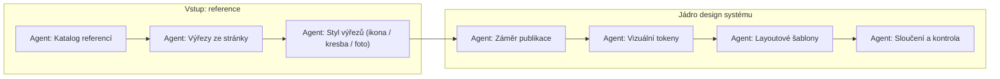

# Design systém — kolik „agentů“ a co kdo dělá

Tento dokument shrnuje **všechna AI volání** okolo design systému (canvas / Laiout „Design systém 2“) a vyjasňuje, kde je **jeden** velký model a kde jde o **řetězec** menších kroků.

---

## 1. Mentální model: není „agent na bloky + agent na layouty + agent na obrázky“ (v jednom kroku)

Při **„Vygenerovat design systém z briefu“** (`generateAndSaveDesignSystemFromBrief` v `src/utils/ai/design-system-from-brief.ts`) jde v **produkčním kódu** o:

1. **Agent záměru publikace** — jedno volání `chatWithAIProxy` s **`gemini-3-flash`** (jen text + katalog název referencí, bez pixelů): JSON `{ bookKind, generationBlockTypes, rationale }`.
2. **Hlavní design agent** — jedno volání **`gemini-3.1-pro`** s multimodálním obsahem (brief + obrázky); do uživatelské zprávy se přidá záměr z kroku 1. Po validaci se `generationBlockTypes` z kroku 1 **sloučí** do patch.
3. **Uložení** — `saveDesignSystem` (bez LLM).

Hlavní model v **jedné odpovědi** vrací jeden JSON objekt (patch), ze kterého se po validaci složí:

| Oblast | Co model navrhne v tom samém JSON | Poznámka |
|--------|-----------------------------------|------------|
| **Typy bloků** | `blockPreferences.generationBlockTypes`, `preferred`, případně `defaultVisualStyles` | Není samostatný „agent pro bloky“. |
| **Layouty** | `suggestedLayouts` — pole šablon (skupina + sloty: heading, paragraph, image, …) | Není samostatný „agent pro layouty“. Po uložení je z toho v kódu (`buildDesignSystemForSave` v `src/types/design-system-agent.ts`) **deterministicky** vygenerováno `customLayouts` (konkrétní worksheet bloky přes `worksheetBlocksFromLayoutSlots`). |
| **Vizuální styl knihy** | `colors`, `typography`, `pageDefaults` | Stejný call. |
| **Ilustrace / AI k učebnici** | `aiPrompts.imageStyle`, `negativePrompt`, `characterStyle` | Stejný call. |

Tedy: **jeden textový multimodální agent** plní roli „bloky + layoutové šablony + tokeny + ilustrační prompty“ najednou. Rozdělení na „druhého agenta pro layouty“ v kódu **neexistuje** — rozklad layoutů do bloků dělá **TypeScript**, ne druhé LLM.

---

## 2. Po nahrání referenčního obrázku (stránka / screenshot) — řetězec vision kroků

Soubor `src/utils/ai/design-system-reference-upload-analyze.ts`. Tady **není** jedna odpověď jako u briefu; jde o **postupné pokusy** (a fallback Pro → Flash), aby se našly výřezy a role (layout vs ilustrace):

| Pořadí | Funkce / krok | Účel |
|--------|----------------|------|
| A | `runVisionAnalyze` | Klasifikace druhu stránky + počáteční `illustrationBoxes`. Modely: **gemini-3.1-pro** → **gemini-3-flash**. |
| B | `runVisionExtractIllustrationsOnly` | Druhý textový průchod, když z A nejsou boxy. Opět Pro → Flash. |
| C | `runImportStyleIllustrationExtractor` | Stejná sémantika jako záložka **AI import** — JSON s `blocks` typu `image` a `_cropBox` / `_galleryCropBoxes`. Pro → Flash. |
| — | `cropNormalizedRegionToPngDataUrl` + upload | **Žádné LLM** — ořez canvasem z URL (fetch → blob kvůli CORS). |

`analyzeLayoutAndBoxes` tyto kroky skládá: nejdřív A, případně B, pokud jsou boxy prázdné → C; při úplném selhání A se zkusí rovnou C.

**Shrnutí:** u referencí mluvíme o **několika po sobě jdoucích LLM voláních** (stejná úloha z různých úhlů / fallback), ne o jednom „design agentovi“.

---

## 3. Další AI kroky mimo hlavní generování

| Akce | Soubor | LLM / model |
|------|--------|-------------|
| Přegenerovat prompty ilustrací z referencí | `src/utils/ai/regenerate-design-system-ai-prompts.ts` | **Jedno** volání (`gemini-3-flash`) |
| Náhodný náhled ilustrace (tlačítko na canvasu) | voláno z `DesignSystemCanvasWorkspace` | **Generování obrázku** (Imagen / image model — není to stejný „textový agent“ jako výše) |

---

## 4. Kdy dává smysl „více agentů“ (více LLM kroků)

- **Současný produkt:** hlavní DS = **1 velký call**; reference = **řetězec** vision + ořezy; úprava promptů = **1 call**.
- **Rozšíření** (např. automatická kategorizace výřezů: ikony / kresba / fotka s vlastními prompty): typicky **další samostatný** call až **po** výřezech, aby nekomplikoval jeden obří JSON — to by byl nový krok v pipeline, ne změna počtu agentů u bodu 1.

---

## 5. Rychlá odpověď na otázku „kolik agentů?“

- **Jeden hlavní „design agent“** (Gemini 3.1 Pro) pro celý patch design systému z briefu včetně `suggestedLayouts` a typů bloků.
- **Nula až několik** dalších **vision** pokusů při nahrání stránky (klasifikace + výřezy + import-styl).
- **Volitelně jeden** další call při „Přegenerovat prompty“.
- **Samostatně** image generátor pro náhled ilustrace.

Kód, který ze `suggestedLayouts` dělá konkrétní **skupiny layoutů** v editoru, je **deterministický** (`buildDesignSystemForSave` + `worksheetBlocksFromLayoutSlots`) — není to další LLM.

---

## 6. Návrh: více agentů, kteří si předávají úkoly

Současný stav (§1–3) je z větší části **jeden velký patch** + **řetězec vision fallbacků**. Níže je návrh, jak totéž (a rozšíření) rozdělit do **jasných rolí** s **mezikroky** (JSON mezi agenty), které může validovat kód a případně uživateli ukázat.

### 6.1 Princip

- **Orchestrátor** není nutně LLM — může to být **TypeScript** (kroky, retry, podmínky „když nejsou výřezy, zavolej agenta B“).
- Každý **agent** = jedno specifické systémové zadání + vstup/výstup ve **stabilním formátu** (JSON schema).
- **Předání úkolu** = předání strukturovaného výstupu z kroku *n* jako vstupu do kroku *n+1* (plus původní brief / URL obrázků).

*(Šipky zjednodušují hlavní tok; některé vstupy mohou jít paralelně — viz níže.)*

### 6.2 Agenti — role, vstup, výstup

| Agent (pracovní název) | Co dělá | Vstup | Výstup (příklad) | Poznámka |
|------------------------|---------|-------|-------------------|----------|
| **1 — Katalog referencí** | Z textu uživatele + seznamu nahraných souborů sestaví **katalog řádků** (název, role layout vs ilustrace, stručná poznámka). | brief, `DatasetFile[]` metadat | `referenceCatalog[]` pro další kroky | Levný model stačí; nebo heuristika + LLM. |
| **2 — Výřezy ze stránky** | Najde boxy, ořeže, nahraje do Storage. | URL layout obrázku | `cropUrls[]` + normalizované boxy | Dnešní logika v `design-system-reference-upload-analyze.ts` + crop — **LLM jen na boxy**, ne na upload. |
| **3 — Taxonomie ilustrací** | Ke každému výřezu přiřadí **kategorii stylu** (např. ikona / kreslená ilustrace / fotka) a krátký **prompt hint** pro generátor. | náhledy výřezů (URL nebo inline) | `{ id, styleKind, label, promptHint }[]` | Samostatný vision/text call; může běžet **až po** agentovi 2. |
| **4 — Záměr publikace** | Rozhodne **typ knihy** (učebnice vs pracovní sešit), které **typy bloků** dávají smysl, prioritu aktivit. | brief + katalog + volitelně taxonomie | `publicationIntent`: typ knihy, doporučené `generationBlockTypes`, poznámka | Oddělení od „jak to vypadá“. |
| **5 — Vizuální tokeny** | Navrhne **barvy, typografii, stránku**, případně název DS. | brief + reference (vision) + intent | `colors`, `typography`, `pageDefaults`, `name?` | Silný multimodální model (např. 3.1 Pro). |
| **6 — Layoutové šablony** | Navrhne **`suggestedLayouts`** (sloty 12-sloupcové mřížky). | intent + tokeny (nebo zjednodušený souhrn) + brief | `suggestedLayouts[]` | Může být stejný model jako 5 **v druhém callu**, aby se zmenšil kontext; nebo specializovaný prompt. |
| **7 — Ilustrační prompty** | Doplní / zpřesní `aiPrompts` podle výřezů a taxonomie. | tokeny + taxonomie + katalog | `aiPrompts` (+ případně více variant podle stylu) | Dnešní `regenerate-design-system-ai-prompts` je předobraz. |
| **8 — Sloučení a kontrola** | Sloučí dílčí JSON do **`DesignSystemAgentPatch`**, zkontroluje konzistenci (hex, fonty, sloty). | výstupy 4–7 | jeden `patch` | Může být **deterministické** sloučení + případně **malý LLM** „jen oprav rozpor“. |

### 6.3 Pořadí a paralelita

- **Sekvence nutná:** 2 → 3 (výřezy před stylizací výřezů); 4 → 5 → 6 pokud každý krok bere výstup předchozího.
- **Paralelita možná:** po dokončení **2** lze paralelně spustit **3** (taxonomie výřezů) a **4** (záměr publikace z briefu), pokud 4 nepotřebuje výstup 3 — nebo 4 jen z briefu a 5 čeká na sloučení 3+4.

### 6.4 Co zůstane bez LLM

- Převod `suggestedLayouts` → `customLayouts` (**`worksheetBlocksFromLayoutSlots`**).
- Upload obrázků, strip base64 z DB, validace typů.

### 6.5 Trade-offy

| | Jeden velký call (dnes) | Více agentů (návrh) |
|--|-------------------------|---------------------|
| Latence | nižší | vyšší (součet kroků) |
| Cena | 1× drahý call | více levných + 1–2 drahé |
| Kontrola / ladění | hůř čitelné chyby | u každého kroku menší JSON, lepší logování |
| Konzistence mezi barvami a layouty | model drží v hlavě najednou | nutný **agent 8** nebo pečlivé sloučení |

### 6.6 Doporučení pro implementaci

1. **Fáze A:** Rozdělit jen **generování z briefu** na **Agent 4 (intent)** + **Agent 5+6 (vizuál + layouty)** + deterministické sloučení — ověřit, že výstupy sedí s `sanitizeDesignSystemAgentPatch`.
2. **Fáze B:** Přidat **Agent 3** po výřezech pro kategorie stylů + propojit s UI a generátorem náhledů.
3. **Orchestrátor** držet v jednom modulu (např. `design-system-multi-agent-orchestrator.ts`) s jednoznačným pořadím a telemetrií.

---

*Poslední aktualizace: sladěno s `design-system-from-brief.ts`, `design-system-reference-upload-analyze.ts`, `design-system-agent.ts`; §6 = návrh multi-agent pipeline.*
